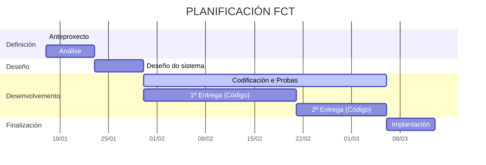

# Anteproxecto Fin de Ciclo  
## Aplicación web de recomendación e comparación de videoxogos

- [Anteproxecto fin de ciclo](#anteproxecto-fin-de-ciclo)
  - [1- Descrición do proxecto](#1--descrición-do-proxecto)
  - [2- Empresa](#2--empresa)
    - [2.1- Idea de negocio](#21--idea-de-negocio)
    - [2.2- Xustificación da idea](#22--xustificación-da-idea)
    - [2.3- Segmento de clientes](#23--segmento-de-clientes)
    - [2.4- Competencia](#24--competencia)
    - [2.5- Proposta de valor](#25--proposta-de-valor)
    - [2.6- Forma xurídica](#26--forma-xurídica)
    - [2.7- Investimentos](#27--investimentos)
      - [2.7.1- Custos](#271--custos)
      - [2.7.2- Ingresos](#272--ingresos)
    - [2.8- Viabilidade](#28--viabilidade)
      - [2.8.1- Viabilidade técnica](#281--viabilidade-técnica)
      - [2.8.2 - Viabilidade económica](#282---viabilidade-económica)
      - [2.8.3- Conclusión](#283--conclusión)
  - [3- Requirimentos técnicos](#3--requirimentos-técnicos)
  - [4- Planificación](#4--planificación)

## 1- Descrición do proxecto

O proxecto consiste no desenvolvemento dunha **aplicación web de recomendación e comparación de videoxogos**, orientada a usuarios que desexan descubrir novos títulos segundo os seus gustos, plataformas dispoñibles e valoracións doutros usuarios.

A aplicación permitirá consultar información detallada de cada videoxogo, clasificalos por categorías e plataformas, valorar xogos e visualizar rankings dinámicos segundo as valoracións recibidas nun período de tempo determinado (día, semana ou mes). Ademais, incluirá funcionalidades sociais como un foro organizado por categorías.

O obxectivo principal é ofrecer unha plataforma centralizada e especializada en videoxogos que facilite a toma de decisións á hora de mercar ou probar un xogo, baseándose na experiencia doutros usuarios.

O desenvolvemento da aplicación abre unha oportunidade de negocio ao poder monetizarse mediante publicidade, afiliacións con tendas dixitais de videoxogos ou servizos premium. Para a súa realización empregarase tecnoloxía web actual, tanto no frontend como no backend.

---

## 2- Empresa

### 2.1- Idea de negocio

O produto central é unha **aplicación web de recomendación e comparación de videoxogos**.

O valor engadido reside en ofrecer:
- Recomendacións baseadas en valoracións reais de usuarios.
- Rankings actualizados automaticamente.
- Información organizada por categorías e plataformas.
- Un foro específico para a comunidade xogadora.

Como produto aumentado, poderían ofrecerse funcionalidades premium, como eliminación de publicidade.

---

### 2.2- Xustificación da idea

A idea do proxecto xorde da necesidade de atopar videoxogos adaptados aos gustos persoais nun mercado cada vez máis saturado. Actualmente existen plataformas que ofrecen información sobre videoxogos, pero moitas veces esta información está dispersa ou non está enfocada á recomendación personalizada.

A aplicación pretende cubrir a necesidade de:
- Comparar videoxogos de forma sinxela.
- Consultar opinións reais doutros usuarios.
- Descubrir novos títulos segundo preferencias concretas.

Existen produtos similares no mercado, como webs especializadas ou tendas dixitais, pero non sempre ofrecen recomendacións claras nin unha comunidade centrada na valoración. Isto supón unha oportunidade para crear un servizo máis especializado.

#### Análise DAFO

**Debilidades**
- Proxecto desenvolvido de forma individual.
- Necesidade de captar usuarios para obter valoracións relevantes.

**Ameazas**
- Competencia de plataformas xa consolidadas.
- Cambios constantes no mercado dos videoxogos.

**Fortalezas**
- Especialización exclusiva en videoxogos.
- Plataforma clara e centrada na experiencia do usuario.

**Oportunidades**
- Crecemento continuo da industria do videoxogo.
- Aumento do consumo de contido dixital e recomendacións online.

---

### 2.3- Segmento de clientes

A aplicación vai dirixida principalmente a:
- Persoas afeccionadas aos videoxogos.
- Usuarios habituais de plataformas dixitais e redes sociais.

Distínguense dous perfís:
- **Usuarios**: persoas que utilizan a aplicación para consultar e/ou valorar videoxogos.
- **Clientes**: empresas anunciantes, tendas dixitais ou plataformas de venda de videoxogos.

O mercado potencial é amplo, xa que o sector do videoxogo conta cun gran número de usuarios a nivel nacional e internacional.

---

### 2.4- Competencia

No mercado existen diversas plataformas relacionadas cos videoxogos:
- Páxinas web especializadas en análise de videoxogos.
- Tendas dixitais como Steam ou Epic Games.
- Foros e comunidades online.

Estas plataformas adoitan estar ben posicionadas, pero moitas delas non están centradas exclusivamente na recomendación nin na comparación baseada en valoracións da comunidade, o que permite diferenciar o proxecto.

---

### 2.5- Proposta de valor

A aplicación diferénciase da competencia en:
- Centralizar recomendación, comparación e comunidade nun único lugar.
- Ofrecer rankings dinámicos segundo o tempo.
- Organización clara por categorías e plataformas.

O valor que aporta ao mercado é a facilidade para descubrir videoxogos adaptados aos gustos do usuario, polo que os usuarios escollerán esta plataforma fronte a outras máis xenéricas.

---

### 2.6- Forma xurídica

A forma xurídica escollida sería a de **autónomo**, xa que permite iniciar a actividade cun investimento reducido e cunha xestión máis sinxela, axeitada para un proxecto dixital de pequena escala na súa fase inicial.

---

### 2.7- Investimentos

Os investimentos iniciais necesarios serían:
- Equipo informático.
- Servidor web e base de datos.
- Dominio web.
- Software de desenvolvemento.
- Gastos básicos de subministracións.

---

#### 2.7.1- Custos

**Custos fixos**
- Aloxamento web.
- Dominio.
- Cota de autónomo.

**Custos variables**
- Publicidade.
- Mantemento e melloras da aplicación.

Inclúense tamén os impostos e custos sociais correspondentes.

---

#### 2.7.2- Ingresos

Os ingresos procederían principalmente de:
- Publicidade na plataforma.
- Enlaces de afiliación.
- Subscricións premium.

A política de prezos sería accesible para facilitar a captación de usuarios.

---

### 2.8- Viabilidade

#### 2.8.1- Viabilidade técnica

O proxecto é viable a nivel técnico, xa que se empregan tecnoloxías coñecidas e estudadas ao longo do ciclo. Dispóñense dos medios materiais necesarios e non existen impedimentos técnicos relevantes para o seu desenvolvemento.

---

#### 2.8.2- Viabilidade económica

Os custos iniciais son reducidos, polo que o proxecto pode manterse cun investimento moderado. A medio prazo, os ingresos por publicidade e afiliacións permitirían cubrir os gastos.

---

#### 2.8.3- Conclusión

O proxecto é viable tanto a nivel técnico como económico. Os beneficios potenciais poden superar os custos iniciais e, no caso de perdas, estas poderían cubrirse mediante financiamento ou subvencións.

---

## 3- Requirimentos técnicos

### Infraestrutura
- **Dominio web** proporcionado polo tutor para probar a aplicación durante as prácticas.  
- **Servidor web** facilitado polo tutor, onde se desplegará a aplicación.  
- **Base de datos MySQL** proporcionada polo tutor para almacenar o contido necesario da aplicación.  
- **Acceso FTP** facilitado polo tutor para subir arquivos e actualizar a aplicación.

### Backend
O backend será desenvolvido con **Laravel**, empregando o patrón **MVC** para organizar o código.  
A base de datos **MySQL** almacenará toda a información da aplicación.  
Para o proxecto implementarase un **CRUD dunha funcionalidade** (foro ou xogos), permitindo dar de alta, modificar, eliminar e consultar datos.  

### Frontend
O frontend será desenvolto con **React**, empregando a linguaxe **JavaScript**. Para o estilo e a organización visual usarase **CSS3**, empregando **Flexbox e CSS Grid** para deseñar layouts adaptables a diferentes tamaños de pantalla (móbil, tablet e escritorio), garantindo unha interface amigable e usable.

---

## 4- Planificación

