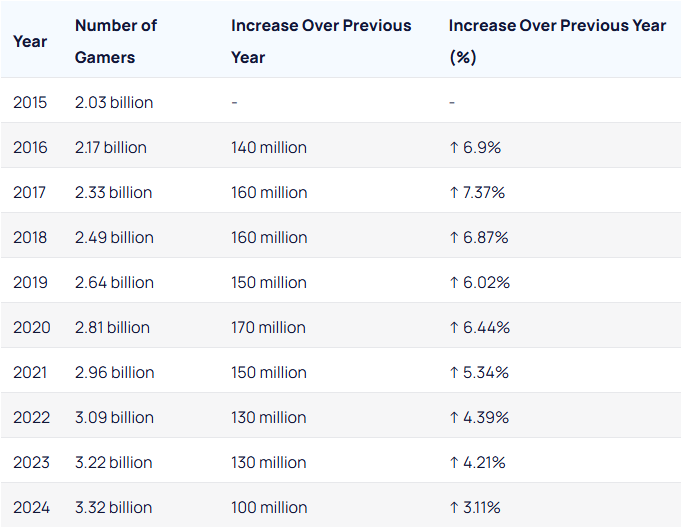
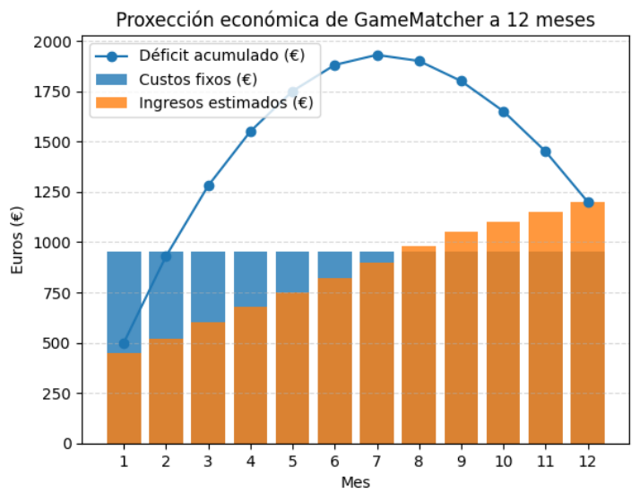
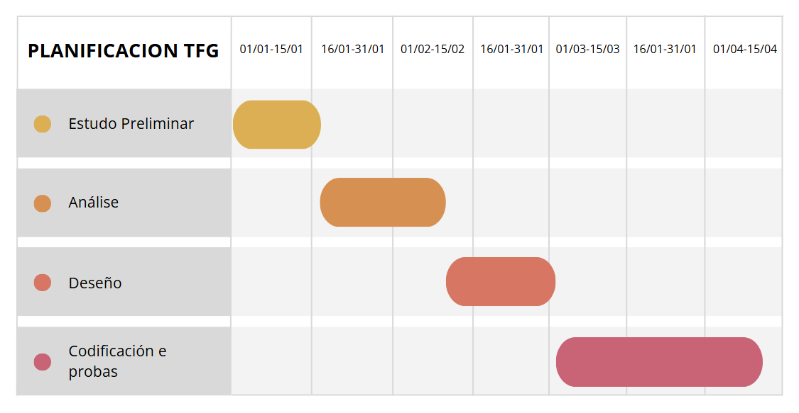

# Anteproxecto Fin de Ciclo  
## Aplicación web de recomendación e comparación de videoxogos

- [Anteproxecto fin de ciclo](#anteproxecto-fin-de-ciclo)
  - [1- Descrición do proxecto](#1--descrición-do-proxecto)
  - [2- Empresa](#2--empresa)
    - [2.1- Idea de negocio](#21--idea-de-negocio)
    - [2.2- Xustificación da idea](#22--xustificación-da-idea)
    - [2.3- Segmento de clientes](#23--segmento-de-clientes)
    - [2.4- Competencia](#24--competencia)
    - [2.5- Proposta de valor](#25--proposta-de-valor)
    - [2.6- Forma xurídica](#26--forma-xurídica)
    - [2.7- Investimentos](#27--investimentos)
      - [2.7.1- Custos](#271--custos)
      - [2.7.2- Ingresos](#272--ingresos)
    - [2.8- Viabilidade](#28--viabilidade)
      - [2.8.1- Viabilidade técnica](#281--viabilidade-técnica)
      - [2.8.2 - Viabilidade económica](#282---viabilidade-económica)
      - [2.8.3- Conclusión](#283--conclusión)
  - [3- Requirimentos técnicos](#3--requirimentos-técnicos)
  - [4- Planificación](#4--planificación)

## 1- Descrición do proxecto

O proxecto consiste no desenvolvemento dunha **aplicación web de recomendación e comparación de videoxogos**, chamada *GameMatcher*, orientada a usuarios que desexan descubrir novos títulos segundo os seus gustos, plataformas dispoñibles e valoracións doutros usuarios.

A aplicación permitirá consultar información detallada de cada videoxogo, clasificalos por categorías e plataformas, valorar xogos e visualizar rankings dinámicos segundo as valoracións recibidas nun período de tempo determinado (día, semana ou mes). Ademais, incluirá funcionalidades sociais como un foro organizado por categorías.

O obxectivo principal é ofrecer unha plataforma centralizada e especializada en videoxogos que facilite a toma de decisións á hora de mercar ou probar un xogo, baseándose na experiencia doutros usuarios.

O desenvolvemento da aplicación abre unha oportunidade de negocio ao poder monetizarse mediante publicidade, afiliacións con tendas dixitais de videoxogos ou servizos premium. Para a súa realización empregarase tecnoloxía web actual, tanto no frontend como no backend.

---

## 2- Empresa

### 2.1- Idea de negocio

O produto central é unha **aplicación web de recomendación e comparación de videoxogos** orientada a usuarios de 16–35 anos interesados en videoxogos e contido dixital, especialmente aqueles que queren tomar decisións informadas sobre que xogos probar ou mercar.

O valor engadido reside en ofrecer:
- Recomendacións baseadas en valoracións reais de usuarios.
- Rankings dinámicos actualizados automáticamente.
- Información organizada por categorías, plataformas e preferencias.
- Foro específico para a comunidade xogadora.

Como produto aumentado, poderían ofrecerse funcionalidades premium, como eliminación de publicidade, acceso anticipado a novas funcionalidades ou eventos exclusivos.

A proposta céntrase en **integrar servizos dispersos nunha mesma plataforma**, permitindo ao usuario descubrir xogos de todo tipo (indie, AAA, clásicos ou recentes) e interactuar cunha comunidade activa, e ás empresas como canal publicitario global e segmentado.

---

### 2.2- Xustificación da idea

A idea do proxecto xorde da necesidade de atopar videoxogos adaptados aos gustos persoais nun mercado cada vez máis saturado. Actualmente existen plataformas que ofrecen información sobre videoxogos, pero moitas veces esta información está dispersa ou non está enfocada á recomendación personalizada.

A aplicación pretende cubrir a necesidade de:
- Comparar videoxogos de forma sinxela.
- Consultar opinións reais doutros usuarios.
- Descubrir novos títulos segundo preferencias concretas.

Actualmente existen plataformas relacionadas co mundo do videoxogo que cobren algunhas das funcionalidades propostas, como tendas dixitais con sistemas de valoración ou webs especializadas en análises. Porén, estas solucións adoitan centrarse nun único aspecto (venda, crítica profesional ou comunidade) e non integran nunha mesma plataforma a comparación de videoxogos, a recomendación baseada en similitude e a interacción social estruturada.
Esta fragmentación do mercado xera a oportunidade de desenvolver unha aplicación especializada que centralice estes servizos, ofrecendo ao usuario unha experiencia máis clara e orientada á toma de decisións.

Segundo datos recentes do mercado global de videoxogos, a facturación anual medrou aproximadamente duns **220,79 billóns de dólares en 2022** a uns **317,91 billóns en 2025**, con proxectos que sitúan o mercado por encima dos **400 billóns en 2027**. Isto indica un crecemento sostido na industria e unha maior oferta de contido dispoñible para os usuarios. :contentReference[oaicite:2]{index=2}
Ademais, o número de xogadores no mundo alcanzou uns **3,22 miles de millóns en 2023** e espera que supere os **3,5 miles de millóns en 2025**, o que amosa unha expansión constante da base de usuarios. :contentReference[oaicite:3]{index=3}

Aquí amosase o incremento de xogadores de videoxogos na última década:

O incremento de xogadores xera unha necesidade de aumento de videoxogos no mercado, o cal favorece a este prroxecto xa que neste tipo de web os novos usuarios xunto cos usuarios mais antigos, poden buscar xogos que encaixen nas súas necesidades, mediante os filtros anteriormente citados. Tamen favorece o apartado dos foros da comunidade xogadora, xa que a mais numero de xogadores maior é a posibilidade de interación nestes foros.

#### Análise DAFO

**Debilidades**
- Proxecto desenvolvido de forma individual, o que pode limitar o ritmo de desenvolvemento e mantemento fronte a solucións empresariais con equipos máis amplos, especialmente en fases de crecemento da plataforma.
- Necesidade inicial de captar un número suficiente de usuarios activos para xerar valoracións e contido comunitario que aporte valor ás recomendacións e rankings.

**Ameazas**
- Existencia de plataformas consolidadas no sector dos videoxogos cunha base de usuarios moi ampla e un alto nivel de visibilidade.
- Dificultade inicial para acadar posicionamento e recoñecemento fronte a servizos xa establecidos no mercado dixital.

**Fortalezas**
- Desenvolvemento dunha plataforma especializada que integra comparación, recomendación e valoración de videoxogos nun único espazo, fronte a solucións fragmentadas.
- Arquitectura técnica baseada en tecnoloxías consolidadas (PHP MVC, MySQL, JavaScript), que facilita o mantemento, a escalabilidade e a evolución do proxecto.
- Uso de fontes de datos fiables mediante a integración da API RAWG, combinadas con valoracións xeradas pola propia comunidade, o que reforza a calidade e credibilidade da información ofrecida.
- Control total do proxecto ao tratarse dun desenvolvemento individual, permitindo unha toma de decisións rápida e unha adaptación flexible ás necesidades do mercado.

**Oportunidades**
- Crecemento constante da industria do videoxogo e aumento do número de usuarios de plataformas dixitais.
- Incremento continuo do catálogo de videoxogos, que xera unha maior necesidade de ferramentas de recomendación e filtrado.
- Tendencia crecente á participación en comunidades online e ao consumo de contido dixital personalizado.

---

### 2.3- Segmento de clientes

GameMatcher diríxese a un mercado específico dentro do sector dos videoxogos, definido a partir de criterios de idade, localización e hábitos de consumo dixital.

**Usuarios principais**  
- Idade: 16–35 anos.  
- Localización inicial: España.  
- Perfil: xogadores habituais e ocasionais que consumen videoxogos en formato dixital (PC e consolas) e que consultan información en liña antes de mercar ou probar un xogo.  
- Hábitos: uso frecuente de plataformas dixitais, participación en comunidades online e interese por descubrir novos xogos segundo preferencias persoais.

**Estimación inicial de usuarios**:  
- Mercado potencial en España: ~18 millóns de persoas xogan a videoxogos.  
- Mercado accesible (16–35 anos, consumo dixital): ~6–7 millóns.  
- Usuarios previstos no primeiro ano: **2500-3000 usuarios rexistrados**, cun núcleo activo inicial de 300–500 usuarios.

**Clientes**  
- Desenvolvedores independentes de videoxogos.  
- Pequenas editoras dixitais.  
- Tendas online de videoxogos e marcas relacionadas co ocio dixital.

**Estimación inicial de clientes**:  
- 5–10 clientes no primeiro ano, principalmente mediante publicidade puntual, afiliacións ou promocións de xogos.

---

### 2.4- Competencia

No mercado existen diversas plataformas relacionadas co mundo dos videoxogos que poden considerarse competencia indirecta de GameMatcher, aínda que ningunha delas cobre de forma específica o mesmo enfoque nin integra todas as funcionalidades propostas.

**Competencia indirecta**  
- **Tendas dixitais** como Steam ou Epic Games, que inclúen sistemas de valoración e recomendación, pero cun enfoque prioritariamente comercial e orientado á venda dos produtos.  
- **Medios especializados e webs de análises**, que ofrecen contido profesional e noticias, pero cunha interacción limitada e sen recomendación personalizada baseada na similitude entre xogos.  
- **Foros e comunidades online**, onde existe participación activa dos usuarios, aínda que a información adoita estar dispersa e non estruturada para a comparación ou recomendación eficiente.

**Posicionamento de GameMatcher fronte á competencia**  
GameMatcher sitúase nun punto intermedio entre estas solucións, ofrecendo unha plataforma especializada na comparación e recomendación de videoxogos baseada en opinións da comunidade, cun enfoque neutral e orientado á toma de decisións por parte do usuario, e non á venda directa.

---

### 2.5- Proposta de valor

*GameMatcher* diferénciase da competencia ao integrar nun único espazo funcionalidades que actualmente se atopan dispersas:

- **Comparación de videoxogos** segundo características, valoracións e preferencias do usuario.
- **Recomendación baseada en xogos similares**, permitíndolle ao usuario descubrir novos títulos adaptados aos seus gustos.
- **Ranking dinámico** de xogos segundo valoracións da comunidade, actualizado día, semana ou mes.
- **Organización clara e intuitiva** por categorías, plataformas e preferencias, facilitando a navegación.
- **Interacción social**, permitindo aos usuarios participar en foros e compartir experiencias.

O principal valor que *GameMatcher* aporta ao mercado é a **posibilidade de tomar decisións rápidas e informadas** sobre que videoxogos mercar ou probar, ao centralizar nunha única plataforma comparacións, recomendacións e valoracións xeradas pola propia comunidade de usuarios, fronte a sistemas baseados exclusivamente en críticas profesionais. Este enfoque permite unha experiencia máis personalizada e próxima aos intereses reais dos xogadores. Isto fai que os usuarios escollan esta aplicación fronte a servizos máis xerais ou fragmentados, e que as empresas (clientes) dispoñan dun canal atractivo para publicidade ou promoción.
Ademais, *GameMatcher* garante a fiabilidade da información mediante o uso de **fontes externas recoñecidas para os datos básicos dos videoxogos**, combinadas con **valoracións realizadas exclusivamente por usuarios rexistrados**. Deste xeito, a plataforma ofrece información actualizada e opinións reais, independentes de intereses comerciais, o que supón un valor engadido tanto para os usuarios finais como para as empresas que utilicen a plataforma como canle de promoción ou publicidade.

---

### 2.6- Forma xurídica

A forma xurídica de **GameMatcher** será a de **autónomo**, a opción máis adecuada para un proxecto dixital de pequena escala na súa fase inicial. Esta elección permite:

- Trámites máis sinxelos e rápidos en comparación con outras formas xurídicas como a SL.  
- Non require capital inicial.  
- Bonificacións na cuota de autónomo nos primeiros meses grazas á tarifa plana ou á **“cuota cero” en Galicia 2026**, reducindo os custos iniciais.

**Resumo:** iniciar a actividade como autónomo permite concentrarse no desenvolvemento e crecemento da aplicación sen asumir un alto risco económico.

---

### 2.7- Investimentos

#### 2.7.1- Custos

Os custos fixos inclúen:
- **Cuota de autónomo:**  0€ hasta final de 2026 en Galicia. Despois ~80 €/mes;
- **Nomina:** 691€/mes (media xornada con 12 pagas prorrateadas)
- **Dominio web (Dinahosting):** 10 – 15 €/ano.
- **Hosting web básico (Dinahosting):** ~33 €/ano (plan compartido, contratación anual).
- **Tarifa de internet:** aprox. 30 €/mes.
- **Asesoría Fiscal:** aprox. 30 €/mes (para xestionar autónomo, impostos e contabilidade).

Custos variables poden incluír:
- Publicidade en redes sociais e micro-influencers : 50–100 €/mes.
- Substitución ou actualización de software (50 – 100 €/ano aprox.).
- Gastos puntuais en eventos ou promocións: 0–200 €/mes.

**Total estimado (fixo + variable inicial):** ~809–1144 €/mes

---

#### 2.7.2- Ingresos

As fontes de ingresos potenciais son:
- **Publicidade en banners:** 1 € – 5 € por cada 1000 visualizacións.
  - Estimación inicial: 50-100 €/mes.
- **Comisións de afiliación:** 5 % – 10 % por venda derivada en tendas dixitais (Steam, Epic) ou merch de videoxogos.
  - Estimación inicial: 50–100 €/mes
- **Subscricións premium mensuais:** 3 – 5 € por usuario.
  - Estimación inicial con estratexia activa: 20-40 usuarios → 100–200 €/mes
- **Eventos ou torneos online (opcional)**: entradas ou patrocinios
  - Estimación inicial: 0–200 €/mes

**Total de ingresos inicial estimado**: 200-600€
Estes rangos son estimacións habituais no mercado actual e permiten defender a viabilidade económica do proxecto.

---

### 2.8- Viabilidade

#### 2.8.1- Viabilidade técnica

*GameMatcher* é viable a nivel técnico, xa que se basea no uso de tecnoloxías consolidadas, amplamente empregadas no desenvolvemento de aplicacións web e adecuadas ás necesidades do proxecto.

- **Backend**: desenvolvemento en **PHP**, empregando o patrón **MVC**, o que permite unha correcta organización do código, facilita o mantemento e favorece a escalabilidade da aplicación.
- **Base de datos**: **MySQL**, empregada para a xestión estruturada da información de usuarios, valoracións, comentarios e relacións cos videoxogos obtidos a través da API externa.
- **Frontend**: **HTML5**, **CSS3**, **Bootstrap** e **JavaScript**, utilizando chamadas asincrónicas mediante **fetch/AJAX** para mellorar a experiencia do usuario ao interactuar coa aplicación sen necesidade de recargar a páxina.

O proxecto dispón dos medios materiais necesarios, como dominio web, servidor e ferramentas de desenvolvemento, non existindo impedimentos técnicos relevantes para a súa implementación. Ademais, a integración da **API RAWG** permite obter información actualizada dos videoxogos de forma automatizada, garantindo a consistencia e fiabilidade dos datos, así como a redución de custos e tempo de mantemento.

---

#### 2.8.2- Viabilidade económica

A nivel económico, os custos mensuais estimados son de aproximadamente **809–1146 €/mes**, incluíndo:  

- Cuota de autónomo: 80 €/mes (restituída grazas ao programa **“cuota cero” en Galicia 2026**).  
- Nomina: 691€/mes (media xornada con 12 pagas prorrateadas).
- Dominio y Hosting Web: 3,5-5€/mes
- Asesoría fiscal: 30 €/mes.  
- Tarifa de internet: 30 €/mes.  
- Mantemento e substitución de hardware: 5–10 €/mes.  
- Publicidade: 50–100 €/mes.
- Gastos puntuais en eventos ou promocións: 0–200 €/mes.

Os ingresos potenciais de *GameMatcher*, tomando como referencia unha comunidade inicial de usuarios e fontes como subscricións premium, publicidade e afiliacións, poderían acadar **~200-600 €/mes** nunha primeira fase.  
A medio prazo, coa ampliación de usuarios activos e aumento da publicidade e afiliacións, os ingresos poderían superar claramente os custos mensuais, garantindo a sustentabilidade económica do proxecto.  

**Gráfico da viabilidade do proxecto nos primeiros 12 meses**

---

#### 2.8.3- Conclusión

Polo consecuente *GameMatcher* podería decirse que é viable tanto a nivel técnico como económico.  
- A curto prazo, podería existir un pequeno déficit inicial, pero é asumible dentro dun proxecto experimental e mellorable mediante promoción e captación de usuarios.  
- A medio e longo prazo, os ingresos derivados de subscricións premium, publicidade e afiliacións permitirían cubrir os custos fixos e variables, asegurando a rendibilidade.  
- Ademais, a bonificación da **cuota cero** facilita a viabilidade inicial e minimiza riscos económicos.  

---

## 3- Requirimentos técnicos

### Infraestrutura

O proxecto estará aloxado en **Dinahosting**, un servizo de aloxamento web profesional que ofrece soporte completo para proxectos web como o noso. A infraestrutura dispoñible incluirá:

- **Dominio web:** unha dirección pública propia para acceder á aplicación.  
- **Servidor web:** con soporte para PHP e Apache/Nginx, configurado para executar a aplicación de forma estable e segura.  
- **Base de datos MySQL:** para almacenar toda a información da aplicación.  
- **Acceso FTP/SFTP:** para subir, xestionar e actualizar os ficheiros da aplicación de forma cómoda e segura.  

Esta infraestrutura garante que a aplicación poida estar accesible de forma continua, cun rendemento axeitado para o CRUD dunha funcionalidade e con capacidade para futuras ampliacións sen necesidade de contratar recursos adicionais.

### Backend
O backend será desenvolvido con **PHP**, empregando o patrón **MVC** para organizar o código.  
A base de datos **MySQL** empregarase para almacenar a información propia da aplicación, como usuarios rexistrados, valoracións, comentarios, listas de favoritos e datos do foro.  
Para o proxecto implementarase un **CRUD dunha funcionalidade** (foro ou xogos), permitindo dar de alta, modificar, eliminar e consultar datos.
O uso de **MVC** garante unha correcta separación entre modelo, vista e controlador, facilitando o mantemento e futuras ampliacións da aplicación.

### Frontend
O **frontend** será desenvolvido con:

- **HTML5** e **CSS3** para estruturar e estilizar a interface.
- **JavaScript**, empregando chamadas asincrónicas mediante **fetch/AJAX** para interactuar co backend e actualizar a información sen recargar a páxina.
- **Bootstrap** para acelerar o deseño responsive e aproveitar compoñentes predefinidos como botóns, formularios, táboas e modais.
- **Flexbox e CSS Grid** para personalizar layouts e garantir unha experiencia adaptativa a distintos tamaños de pantalla (móbil, tablet e escritorio).

O uso combinado de **Bootstrap** e **CSS3** permite:
- Aproveitar a estrutura responsive e os compoñentes listos de Bootstrap.
- Mantelo flexible e personalizable coas túas propias regras de CSS, adaptando estilos, cores, tamaños e disposicións específicas.
- Garantir unha interface amigable, clara e usable para os usuarios, onde a información de xogos, rankings, filtros e foros sexa fácil de consultar e interactuar.

---

## 4- Planificación

